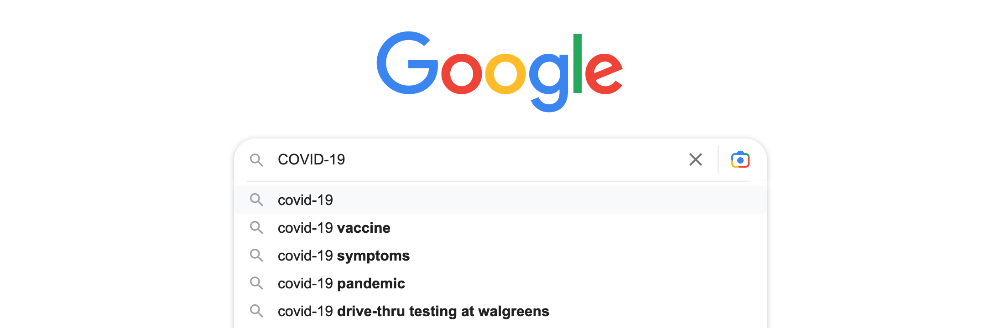
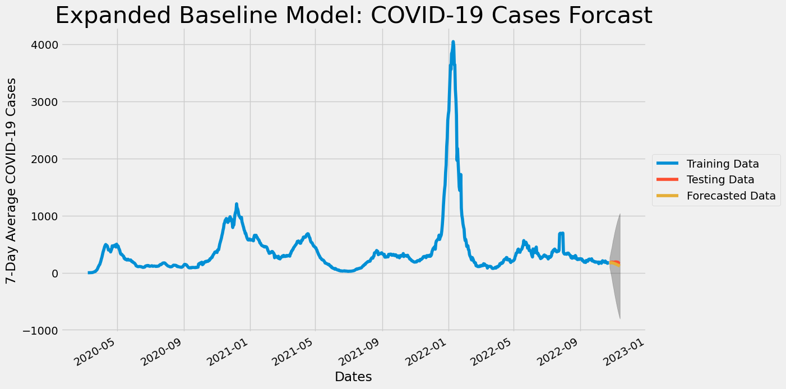
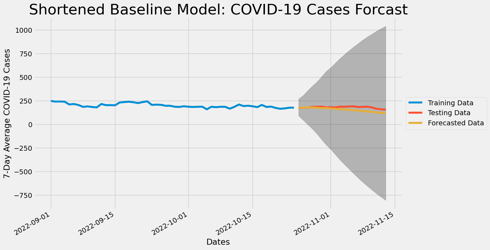
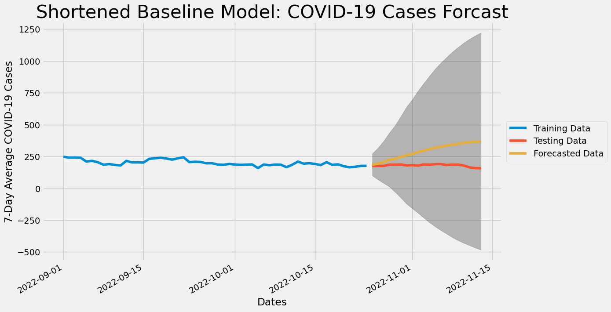

# Searching for COVID: Using Google Search Data to Predict COVID-19 Cases in Philadelphia

The city of Philadelphia has been tracking its COVID-19 cases since the beginning of the pandemic. They want to know if they can use Google's COVID-19 related search data to better predict COVID-19 cases which would give the city time to better prepare for spikes in COVID-19 cases.  Unfortunately, the model that incorporated the Google search data performed worse than a model based only on the COVID-19 data. That means that, at least with the model we made, we *could not* use Google's COVID-19 related search data to better predict COVID-19 cases in Philadelphia. 

 

# Business and Data Understanding

## Business Problem

The city of Philadelphia has been tracking its COVID-19 cases since the beginning of the pandemic. They want to know if they can use Google's COVID-19 related search data to better predict COVID-19 rates. If a model to give advanced warning could be made it would give the city of Philadelphia time to be able to prepare for spikes in COVID-19 cases and increase preventative measures (mask mandates, encouraging social distancing, warn hospitals, etc.) when needed.

## Data

 

In order to do this analysis, there were two data sets that we put together. 

The independent variables were taken from [Google's Explore COVID-19 Symptoms Search Trends](https://pair-code.github.io/covid19_symptom_dataset/?country=IE). The data was downloaded from the USA region (sub region of Pennsylvania) at the daily resolution. All of the data from January 1st, 2020 through November 11th, 2022 was then collated into one data frame, containing 68,805 rows and 430 columns. This data had all been [scaled and normalized](https://storage.googleapis.com/gcp-public-data-symptom-search/COVID-19%20Search%20Trends%20symptoms%20dataset%20documentation%20.pdf) prior to being downloaded. 

The target variable was taken from [COVID-19 Data for Pennsylvania](https://www.health.pa.gov/topics/disease/coronavirus/pages/Cases.aspx). This data spanned from March 1st, 2020 until March 14, 2023 and included 75,412 rows and 12 columns. 

### Limitations of the dataset

 

While these two datasets do include a fairly comprehensive list of the search terms and COVID-19 case counts, they do not include all of the possible elements relevant to the rise and fall of COVID-19 cases - for example they don't take into account the proliferation of novel versions of the virus (e.g. Delta, Omicron, etc.). The dataset is also limited by time - [COVID-19 was only proclaimed a pandemic by the World Health Organization on March 11th, 2020](https://www.yalemedicine.org/news/covid-timeline). As such, it could be that better predictions will be available as more time passes, allowing for more data to be collected. 

### Why We Used This Dataset

As the initial inquiry was about if search trends could be used to predict COVID-19, we felt that these data sets were a perfect place to start! Google is a leading search engine, so it seemed an intuitive place to collect search data from. All of the acquired data was free and publicly available. 

### Dataset Size

Initially, we had two datasets, one with **68,805** rows and **430** columns, the other with **75,412** rows and **12** columns. After subsetting these datasets to include **only the Philadelphia region**, cleaning the data, and matching the dates of the datasets, we had **991** rows (representing from March 8th, 2020 to November 13th, 2022) and **423** columns.

# Modeling and Evaluation 

The analysis began by cleaning and processing the Google COVID-19 search data and the public Pennsylvania COVID-19 data. Both datasets were then subset so as to only include Philadelphia county. These datasets were then joined together. After joining the datasets and creating some initial visualizations of the case counts data, a train-test split was performed. We then used `pmdarima.arima.auto_arima` to run a grid search. This grid search allowed us to find the optimal orders to model the chosen target variable (7-Day Average COVID-19 Cases) using `statsmodels.tsa.statespace.sarimax.SARIMAX`. This SARIMAX model was our baseline model. 

 
 

We then performed a PCA (Principal Component Analysis), and after assessing the principal components, we used them along with our target variable in our VAR (Vector Auto Regression) model. The VAR model we implemented used `statsmodels.tsa.statespace.varmax.VARMAX`. 

 
 

We used loss functions to evaluate and compare our two models. The baseline model rounded results were MAE: `24.86`, RMSE: `29.80`, MAPE: `0.14`. The VAR model rounded results were MAE: `111.87`, RMSE: `128.19`, MAPE: `0.63`. As the baseline model outperformed the VAR model, we cannot say that using the Google search trends is helpful in predicting COVID-19 cases, at least with the model created in this notebook. 
