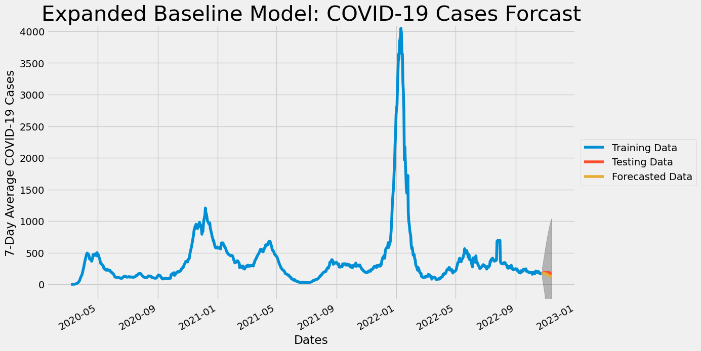
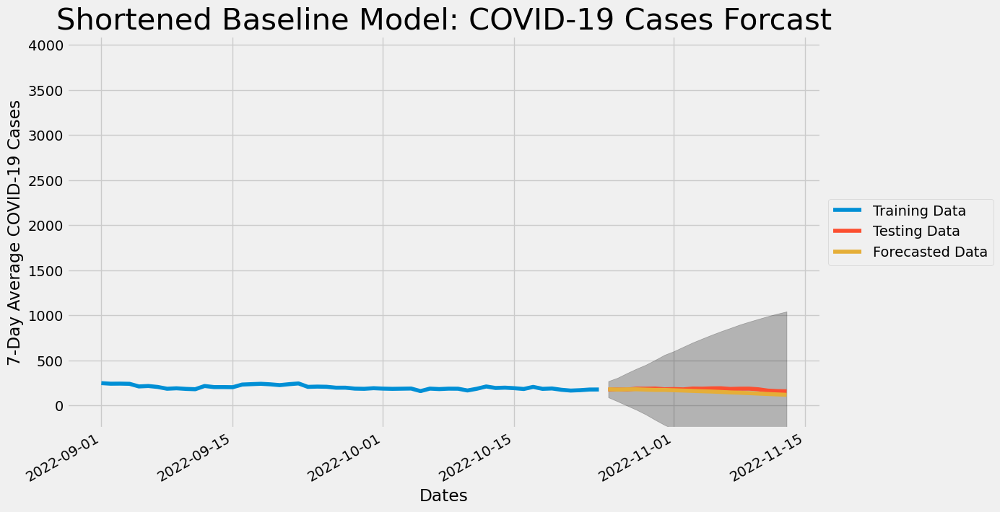
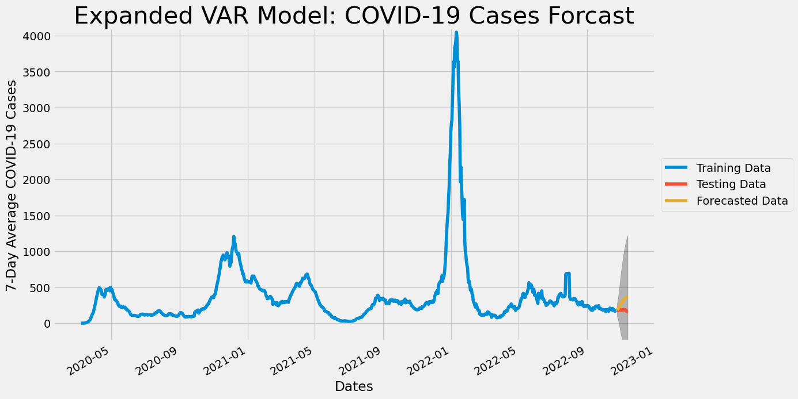
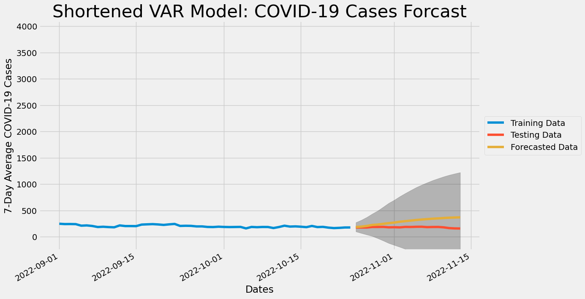
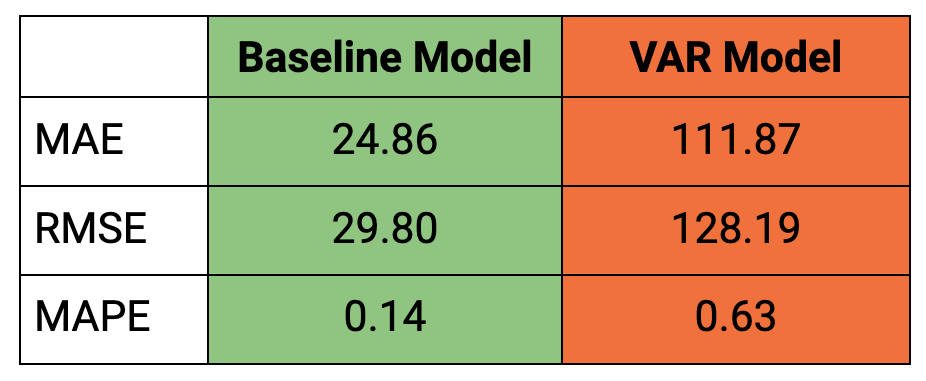

# Searching for COVID: Using Google Search Data to Predict COVID-19 Cases in Philadelphia

The city of **Philadelphia** has been tracking its COVID-19 cases since the beginning of the pandemic. They want to know if they can use **Google's COVID-19 related search data** to better predict **COVID-19 cases** in Philadelphia. This would give the city time to prepare for spikes in COVID-19 cases.  Unfortunately, the model that incorporated the Google search data performed worse than a model based only on the COVID-19 data. That means that, with the models created here, using Google's COVID-19 related search data did not help predict COVID-19 cases in Philadelphia better than modeling the COVID-19 cases in Philadelphia on their own. 

 

# Business and Data Understanding

## Business Problem

The city of Philadelphia has been tracking its COVID-19 cases since the beginning of the pandemic. They want to know if they can use Google's COVID-19 related search data to better predict COVID-19 rates. If a model to give advanced warning could be made it would give the city of Philadelphia time to be able to prepare for spikes in COVID-19 cases and increase preventative measures (mask mandates, encouraging social distancing, warn hospitals, etc.) when needed.

## Data

 


In order to do this analysis, there were two data sets that we put together. 

The independent variables were taken from [Google's Explore COVID-19 Symptoms Search Trends](https://pair-code.github.io/covid19_symptom_dataset/?country=IE). The data was downloaded from the USA region (sub region of Pennsylvania) at the daily resolution. All of the data from January 1st, 2020 through November 11th, 2022 was then collated into one data frame, containing 68,805 rows and 430 columns. This data had all been [scaled and normalized](https://storage.googleapis.com/gcp-public-data-symptom-search/COVID-19%20Search%20Trends%20symptoms%20dataset%20documentation%20.pdf) prior to being downloaded. 

The target variable was taken from [COVID-19 Data for Pennsylvania](https://www.health.pa.gov/topics/disease/coronavirus/pages/Cases.aspx). This data spanned from March 1st, 2020 until March 14, 2023 and included 75,412 rows and 12 columns. 

### Limitations of the dataset

 

While these two datasets do include a fairly comprehensive list of the search terms and COVID-19 case counts, they do not include all of the possible elements relevant to the rise and fall of COVID-19 cases - for example they don't take into account the proliferation of novel versions of the virus (e.g. Delta, Omicron, etc.). The dataset is also limited by time - [COVID-19 was only proclaimed a pandemic by the World Health Organization on March 11th, 2020](https://www.yalemedicine.org/news/covid-timeline). As such, it could be that better predictions will be available as more time passes, allowing for more data to be collected. 

### Why We Used This Dataset

As the initial inquiry was about if search trends could be used to predict COVID-19, we felt that these data sets were a perfect place to start! Google is a leading search engine, so it seemed an intuitive place to collect search data from. All of the acquired data was free and publicly available. 

### Dataset Size

Initially, we had two datasets, one with **68,805** rows and **430** columns, the other with **75,412** rows and **12** columns. After subsetting these datasets to include **only the Philadelphia region**, cleaning the data, and matching the dates of the datasets, we had **991** rows (representing from March 8th, 2020 to November 13th, 2022) and **423** columns.

# Modeling and Evaluation 

The analysis began by cleaning and processing the Google COVID-19 search data and the public Pennsylvania COVID-19 data. Both datasets were then subset so as to only include Philadelphia county. These datasets were then joined together. After joining the datasets and creating some initial visualizations of the case counts data, a train-test split was performed. We then used `pmdarima.arima.auto_arima` to run a grid search. This grid search allowed us to find the optimal orders to model the chosen target variable (7-Day Average COVID-19 Cases) using `statsmodels.tsa.statespace.sarimax.SARIMAX`. This SARIMAX model was our baseline model. 

 
 

This SARIMAX model was our baseline model. We then performed a scree plot to find the optimal number of components to run in our PCA (Principal Component Analysis). Based on the scree plot we chose to reduce our dimensions to two components.The goal of using PCA at this point was to reduce the dimensions of our data into a manageable number of components and then hopefully use those components to build a better but not overly complex model. After assessing the principal components, we used them along with our target variable in our VAR (Vector Auto Regression) model. The VAR model we implemented used `statsmodels.tsa.statespace.varmax.VARMAX`. 

 
 

We used loss functions to evaluate and compare our two models. The baseline model rounded results were MAE: `24.86`, RMSE: `29.80`, MAPE: `0.14`. The VAR model rounded results were MAE: `111.87`, RMSE: `128.19`, MAPE: `0.63`. As the baseline model outperformed the VAR model, we cannot say that using the Google search trends is helpful in predicting COVID-19 cases, at least with the model created in this notebook. 

# Conclusion

Here are the comparisons of the loss function performance between the two models:
 
 

Unfortunately, the model that incorporated the Google search data performed worse than a model based only on the COVID-19 data. That means that we *could not* use Google's COVID-19 related search data to improve predictions of COVID-19 cases in Philadelphia, at least with the model created in this notebook.

## Recommendations

For now, the best way to predict COVID-19 cases in Philadelphia is by looking at Philadelphia's previous COVID-19 cases.

## Next Steps

There are other types of models that may better utilize the COVID-19 Google search data. Trying out these alternate methods were not possible in the time frame allowed for this project, but may give different results. 

Some possible directions to explore: 
- Modeling VARMA or VARMAX models.
- Using crossvalidation and or recursive modeling methods (documentation [here](https://www.statsmodels.org/dev/examples/notebooks/generated/statespace_forecasting.html#Cross-validation)).
- Include other relevant data (e.g. when novel COVID-19 outbreaks happened, public opinion about COVID-19, vaccination rates) which could improve the predictive ability of the model.  
     
## For More Information
See the full analysis in the [Jupyter Notebook](https://github.com/sanderlin2013/Predicting-COVID-19-in-Philly/blob/main/notebook.ipynb) or review this [presentation](https://github.com/sanderlin2013/Predicting-COVID-19-in-Philly/blob/main/presentation.pdf).

For additional info, contact Rachel Sanderlin at [sanderlin2013@gmail.com](mailto:sanderlin2013@gmail.com)

## Repository Structure

```
├── Images/
├── sandbox/
├── .gitignore
├── README.md
├── environment.yml
├── notebook.ipynb
├── notebook.pdf
└── presentation.pdf
```
# Reproduction Instructions 

## Downloading Data

### Google Data

The independent variables were downloaded from [Google's Explore COVID-19 Symptoms Search Trends](https://pair-code.github.io/covid19_symptom_dataset/?country=IE). The data was downloaded from the USA region (sub region of Pennsylvania) at the daily resolution, for the years 2020, 2021, and 2022. All of the data was from from January 1st, 2020 through November 11th, 2022.

**To download the Google data directly click the following links**:
- [2020 Google data](https://storage.cloud.google.com/gcs-public-data---symptom-search/2020/sub_region_1/daily/2020_US_Pennsylvania_daily_symptoms_dataset.csv)
- [2021 Google data](https://storage.cloud.google.com/gcs-public-data---symptom-search/2021/sub_region_1/daily/2021_US_Pennsylvania_daily_symptoms_dataset.csv)
- [2022 Google data](https://storage.cloud.google.com/gcs-public-data---symptom-search/2022/sub_region_1/daily/2022_US_Pennsylvania_daily_symptoms_dataset.csv)

### PA Data

The target variable was downloaded from [COVID-19 Data for Pennsylvania](https://data.pa.gov/Covid-19/COVID-19-Aggregate-Cases-Current-Daily-County-Hea/j72v-r42c). The data used in this notebook spanned from March 1st, 2020 until March 14, 2023, but the downloadable data is updated weekly.

**To download the PA data directly click the following link**:
- [PA data](https://data.pa.gov/api/views/j72v-r42c/rows.csv?accessType=DOWNLOAD)

### Prepping Data for Notebook Ingestion

Once the bove data is downloaded, copy all `.csv` files into this repo's directory under a new directory named `data`. The updated file structure should then look like this:
```
├── Images/
├── data/
     ├── 2020_US_Pennsylvania_daily_symptoms_dataset.csv
     ├── 2021_US_Pennsylvania_daily_symptoms_dataset.csv
     ├── 2022_US_Pennsylvania_daily_symptoms_dataset.csv
     └── COVID-19_Aggregate_Cases_Current_Weekly_County_Health.csv
├── sandbox/
├── .gitignore
├── README.md
├── environment.yml
├── notebook.ipynb
├── notebook.pdf
└── presentation.pdf
```

## Building the Environment

In order to to run the notebook one must build the appropriate environment. The environment requirements have been saved in the `environment.yml` file. 

1. Clone this repository locally (`git clone git@github.com:sanderlin2013/Predicting-COVID-19-in-Philly.git`)
1. `cd` into the local repo (`cd Predicting-COVID-19-in-Philly`)
1. Run `conda env create -f environment.yml`
1. Wait for environment to be downloaded and installed
1. Run `conda activate covid-env`

For further instructions on how to create an environment using `environment.yml` see [here](https://conda.io/projects/conda/en/latest/user-guide/tasks/manage-environments.html#creating-an-environment-from-an-environment-yml-file)

## Running the Notebook
1. Ensure the environment is built and activated (see "Building the Environment")
1. Run `jupyter notebook`
1. The browser will open a new webpage with your directory 
1. Click into `notebook.ipynb`
1. Run!
